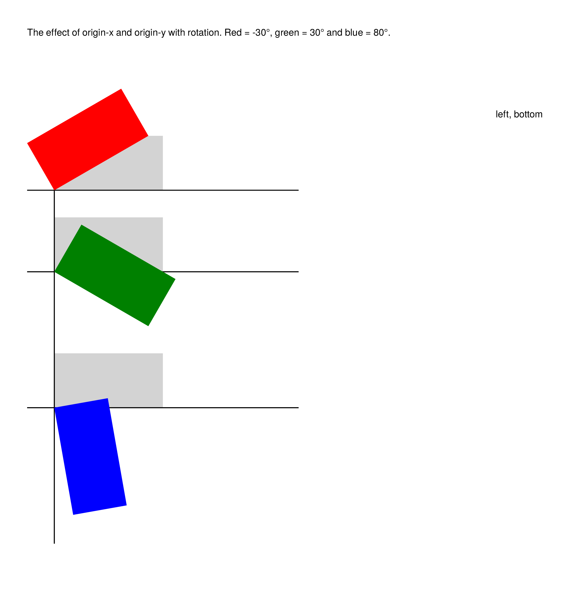
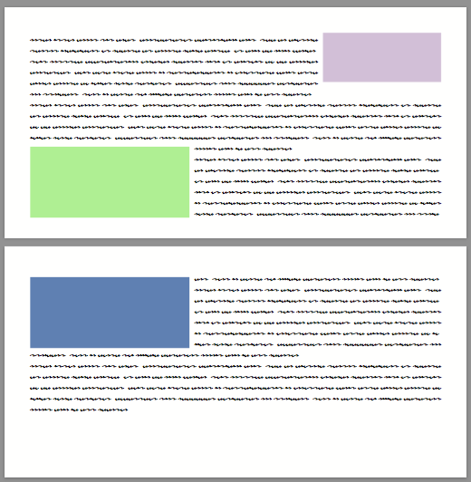
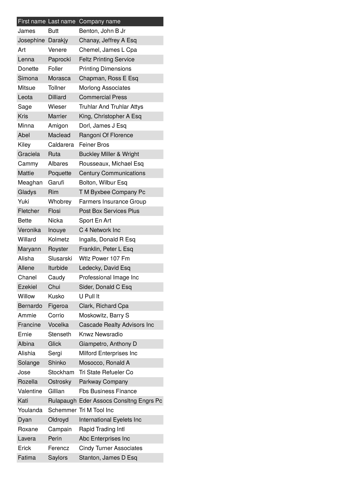
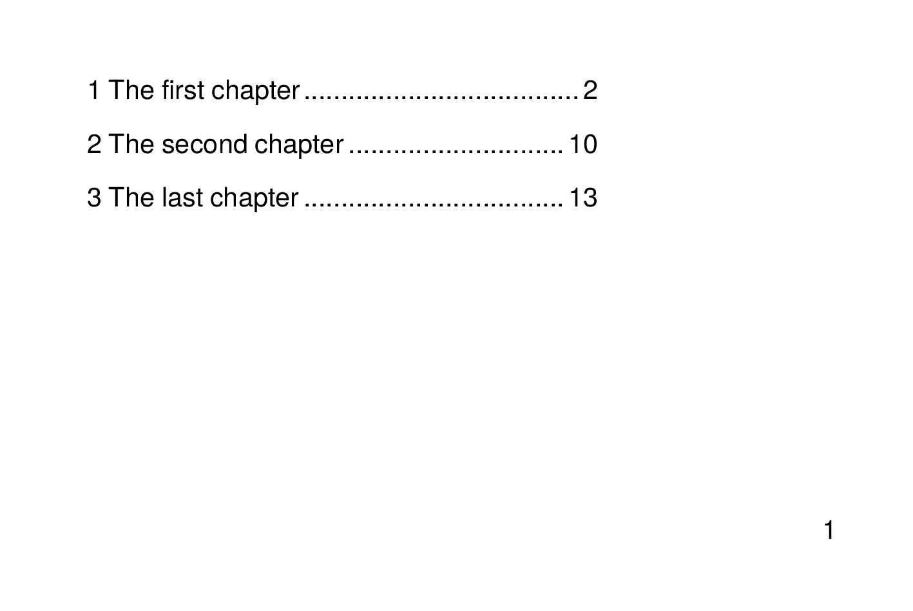
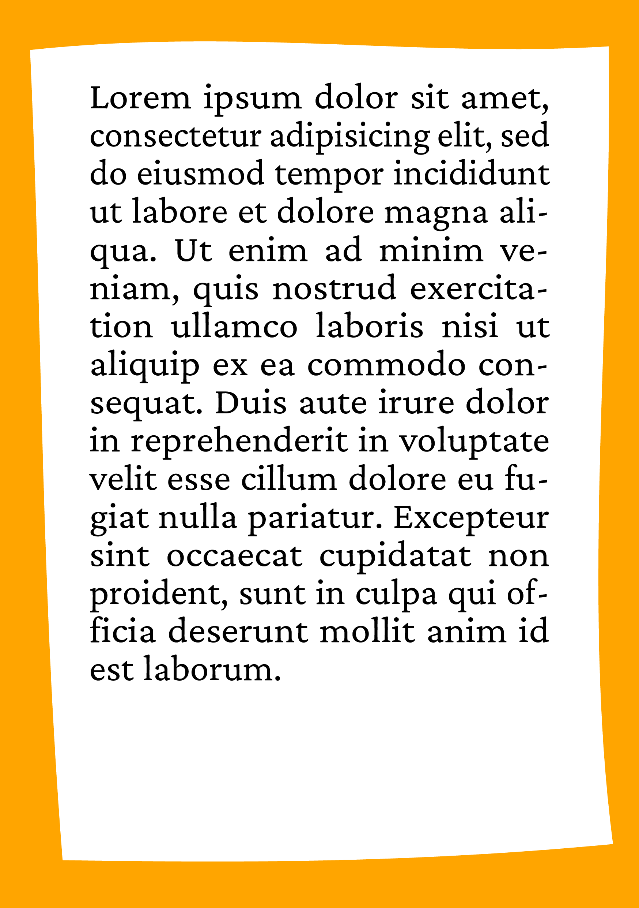

This repository contains examples for the [speedata Publisher](https://github.com/speedata/publisher), an OpenSource database publishing system (create a PDF from XML data).

## Table of contents

- [Showcase](#showcase)
  - [Accessibility](accessibility) · [Newspaper layout](news) · [Magazine layout](magazine) · [Image shape](imageshape) · [TEI text typesetting](shakespeare) · [Tables](tables) · [Typesetting on a grid](grid) · [Typography example](aesopgnatbull) · [SVG chart inclusion](charts)
- [Introduction examples](#introduction-examples)
  - [Hello world](introduction/helloworld) · [Simple table](introduction/simpletable) · [ProcessNode](introduction/dataprocessing1) · [ForAll](introduction/dataprocessing2) · [Text markup sources](introduction/datasource) · [Mail merge](introduction/mailmerge) · [Table of contents](introduction/planets) · [Running sums](introduction/runningsum) · [Text overflow](introduction/textframe) · [Dictionary headings](introduction/dictionary)
- [Technical examples](#technical-examples)
  - [Base64 images](technical/base64decode) · [Copy fitting](technical/fontshrinking) · [Rotate](technical/rotating) · [Wrap around objects](technical/wraparoundobjects) · [Image clipping](technical/images) · [CSV reader](technical/csvreader) · [JSON reader](technical/jsonreader) · [XLSX reader](technical/xlsxreader) · [Table splitting](technical/tablebuilding) · [Table rotation](technical/tablerotation) · [Single pass TOC](technical/singlepasstoc) · [Sorting data](technical/index) · [Mixed text alignment](technical/mixedtextalignment) · [ZUGFeRD invoices](technical/ZUGFeRD)
- [MetaPost examples](#metapost-examples)
  - [Page margin](metapost/pagemargin) · [MetaPost Image](metapost/mpimage)
- [Language examples](#language-examples)
  - [Bengali](languages/bengali) · [Chinese](languages/chinese-sc) · [Language mix](languages/mix)
- [User contributed examples](#user-contributed-examples)
  - [Paragraphs with margin markings](user/cicorione)
- [Comparison of documents](#comparison-of-documents)
  - [Frog King](compare/frogking)

## Showcase

Description  | Preview
------------ | -------------
[Accessibility](accessibility) | 
[Newspaper layout](news) | 
[Magazine layout](magazine) | 
[Image shape](imageshape) | 
[TEI text typesetting](shakespeare) | 
[Tables](tables) | 
[Typesetting on a grid](grid) | 
[Typography example](aesopgnatbull) | 
[SVG chart inclusion](charts) | 

## Introduction examples

Description  | Preview
------------ | -------------
[The Hello world example](introduction/helloworld) | 
[A very simple table](introduction/simpletable) | 
[Data processing with ProcessNode](introduction/dataprocessing1) | 
[Data processing with ForAll](introduction/dataprocessing2) | 
[Different sources of text markup](introduction/datasource) | 
[Lot's of pages](introduction/mailmerge) | 
[Table of contents example](introduction/planets) | 
[Running sums in a table](introduction/runningsum) | 
[Text overflow in a text frame](introduction/textframe) | 
[Dictionary like headings](introduction/dictionary) | 

## Technical examples

Description  | Preview
------------ | -------------
[Base 64 encoded images](technical/base64decode) | 
[Copy fitting with groups](technical/fontshrinking) | 
[Effect of rotate and origin-x/y](technical/rotating) | 
[Text-wrapping around objects](technical/wraparoundobjects) | 
[Image size and clipping](technical/images) | 
[A generic CSV to XML converter](technical/csvreader) | 
[Database publishing with JSON](technical/jsonreader) | 
[Create PDF from Excel files](technical/xlsxreader) | 
[Manual table splitting](technical/tablebuilding) | 
[Fun with rotation in tables](technical/tablerotation) | 
[Single pass table of contents](technical/singlepasstoc) | 
[How to sort data](technical/index) | 
[Alignment of RTL and LTR text](technical/mixedtextalignment) | 
[Creating ZUGFeRD invoices](technical/ZUGFeRD) | 

## MetaPost examples

Description  | Preview
------------ | -------------
[Page margin](metapost/pagemargin) | 
[MetaPost Image](metapost/mpimage) | 

## Language examples

These require speedata Publisher version 4.1 and above.

Description  | Preview
------------ | -------------
[Bengali](languages/bengali) | 
[Chinese (Simplified Chinese)](languages/chinese-sc) | 
[Language mix](languages/mix) | 

## User contributed examples

Description  | Preview
------------ | -------------
[Paragraphs with margin markings](user/cicorione) | 

## Comparison of documents

Comparison of speedata, LaTeX and Apache FOP (currently only one example).

Description  | Preview
------------ | -------------
[Comparison of documents](compare/frogking) | 
