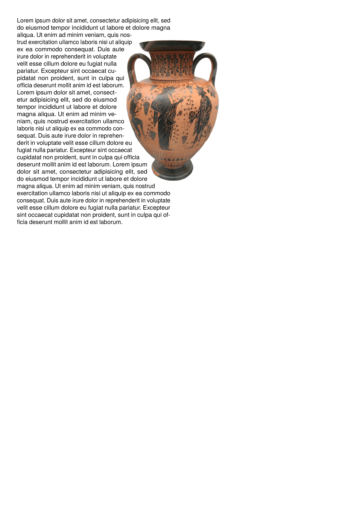

To get the PDF:

Run `sp` on the command line inside this directory.

----

This is an example for a non-rectangular image shape.

The shape is generated by <https://github.com/speedata/imageshaper>.

The license of the image is  Creative Commons Attribution-Share Alike 3.0 Unported, the author is Matthias Kabel. Please see the [web page](https://commons.wikimedia.org/wiki/File:Greek_vase_Dionysos_attica_520_bC.jpg) for more information.
