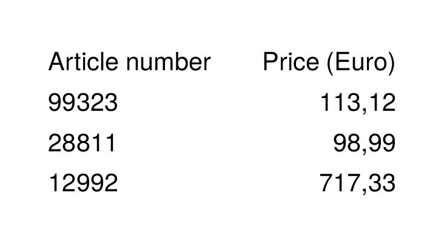
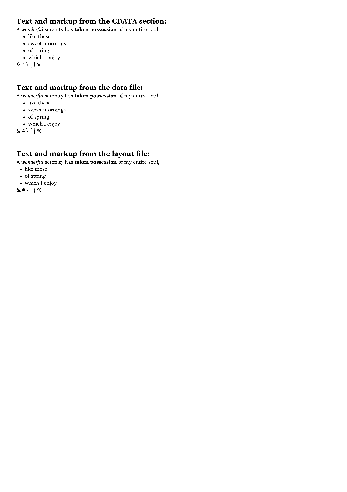
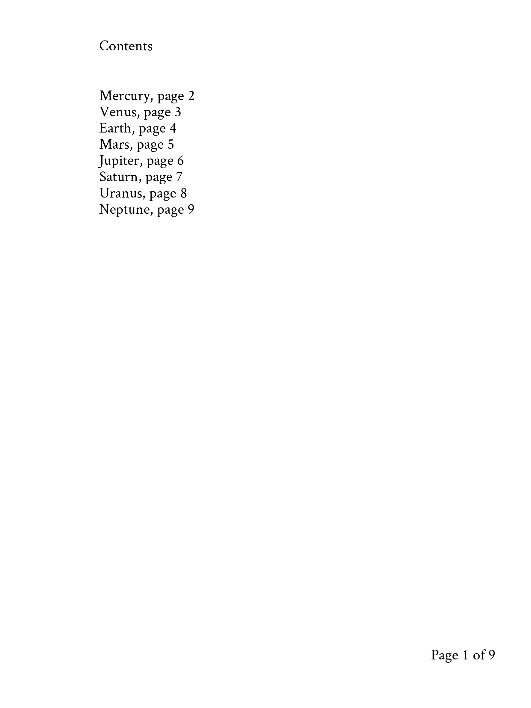
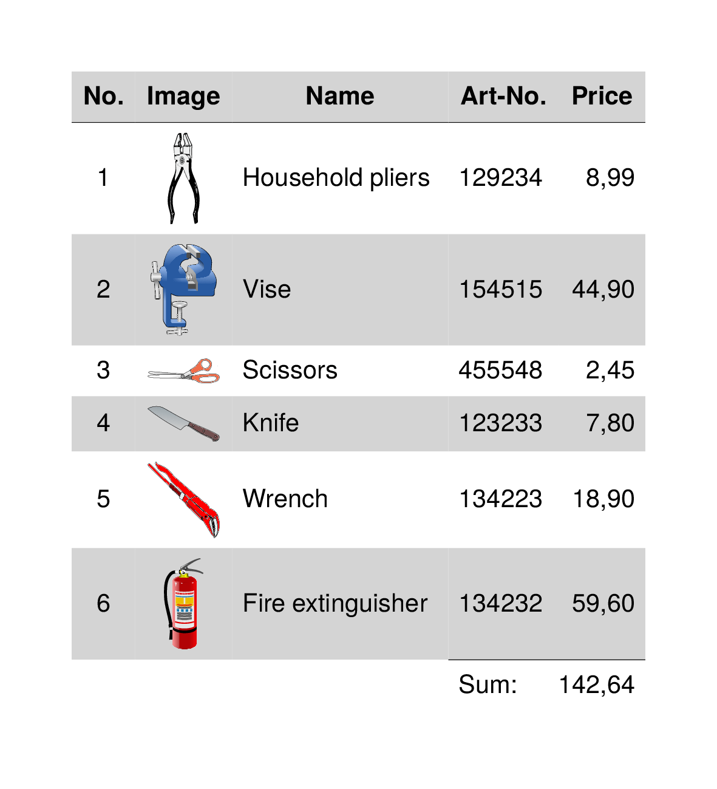
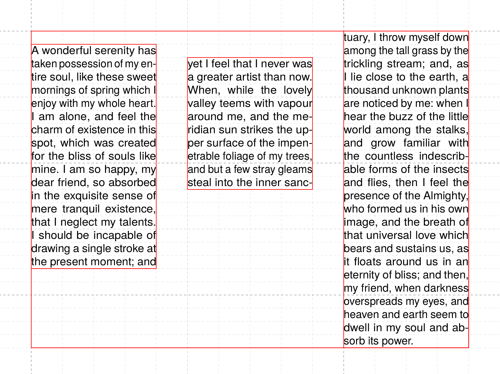
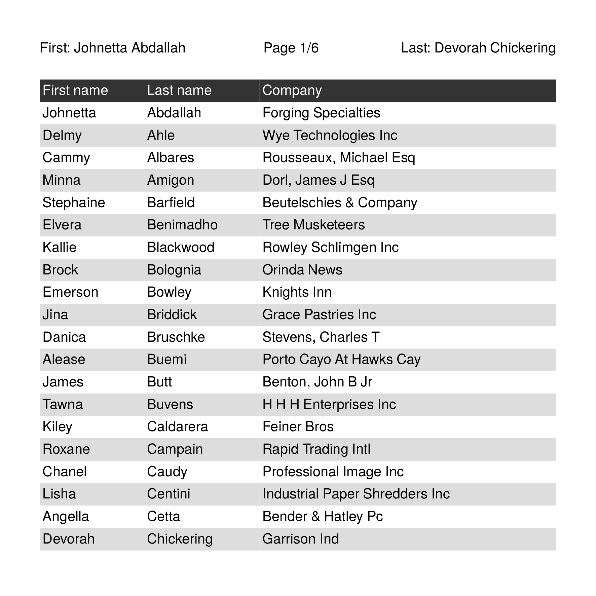

This directory contains introductory examples.

Description  | Preview
------------ | -------------
[The Hello world example](helloworld) | 
[A very simple table](simpletable) | 
[Data processing with ProcessNode](dataprocessing1) | 
[Data processing with ForAll](dataprocessing2) | 
[Different sources of text markup](datasource) | 
[Lot's of pages](mailmerge) | 
[Table of contents example](planets) | 
[Running sums in a table](runningsum) | 
[Text overflow in a text frame](textframe) | 
[Dictionary like headings](dictionary) | 

