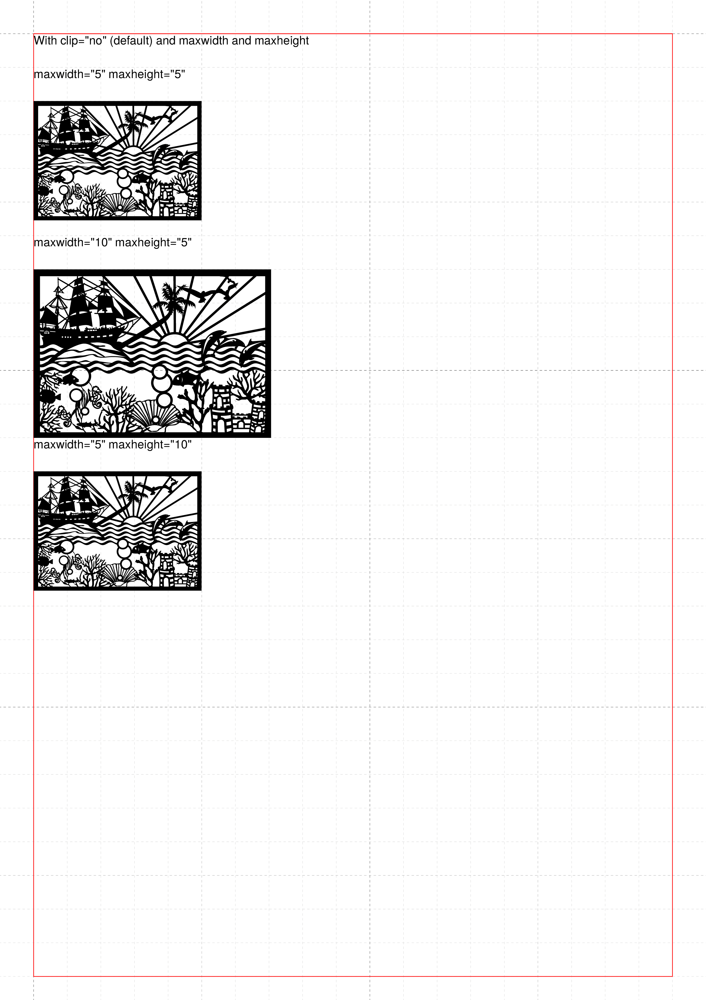
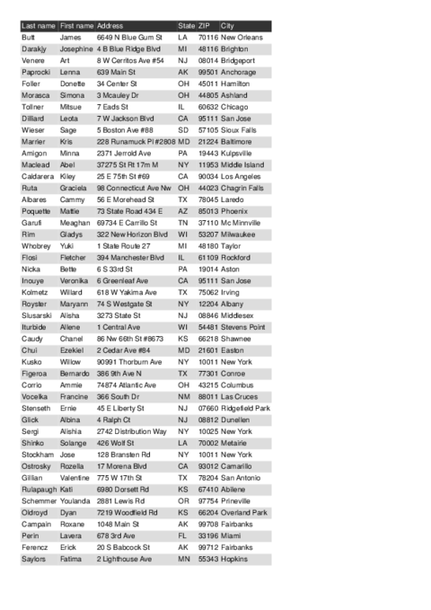

This directory contains some more technical examples.

Description  | Preview
------------ | -------------
[Effect of rotate and origin-x/y](rotating) | 
[Text-wrapping around objects](wraparoundobjects) | 
[Image size and clipping](images) | 
[A generic CSV to XML converter](csvreader) | 
[Database publishing with JSON](jsonreader) | 
[Create PDF from Excel files](xlsxreader) | 
[Copyfitting with groups](fontshrinking) | 
[Single pass table of contents](singlepasstoc) | 
[The new HTML module](html) | 
