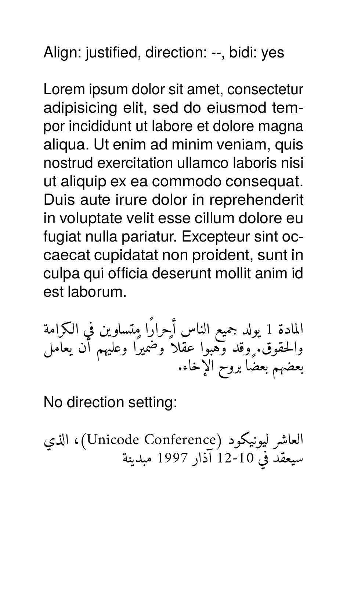

To get the PDF:

Run `sp` on the command line inside this directory.

----

This example shows the how the alignment `start`, `end`, `left`, `right`, `justified` and `centered` work in right-to-left and left-to-right setting.

