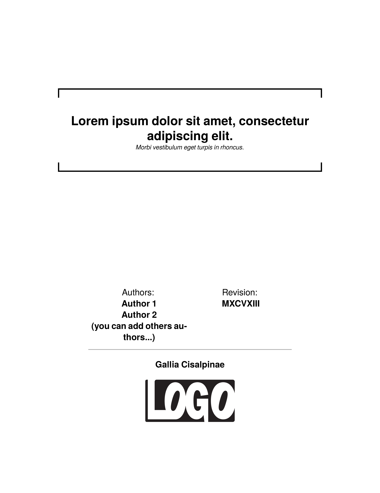

To get the PDF:

Run `sp` on the command line inside this directory.

----

This is a user contributed example for the speedata Publisher. See the [discussion at GitHub](https://github.com/speedata/publisher/discussions/657#discussioncomment-13077414) for more information. It shows clever interaction of paragraphs and additional markings in the margin.

License information: 
SVG: [CC0](https://creativecommons.org/publicdomain/zero/1.0/) (public domain) 
Layout: MIT License (see source code) 
Data: [CC0](https://creativecommons.org/publicdomain/zero/1.0/) (public domain) 

